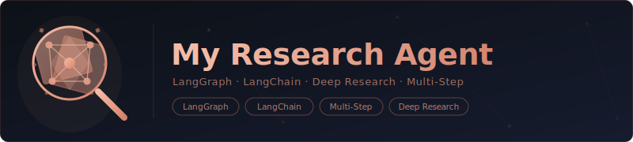

<div align="center">
  
</div>

A multi-step deep research agent built with [LangGraph](https://github.com/langchain-ai/langgraph) and LangChain. Given a query, the agent plans a research strategy, gathers technical literature, searches for candidates, cross-references public sentiment, evaluates completeness, and synthesizes a final report — looping back if the results don't meet its own criteria.

## Prerequisites

- [Docker](https://docs.docker.com/get-docker/) (or a compatible container runtime)
- [VS Code](https://code.visualstudio.com/) with the [Dev Containers](https://marketplace.visualstudio.com/items?itemName=ms-vscode-remote.remote-containers) extension
- An LLM API key — either **`OPENAI_API_KEY`** (OpenAI) or **`MISTRAL_API_KEY`** (Mistral)

## API Keys

The agent auto-selects a provider at startup: **OpenAI `gpt-4o`** if `OPENAI_API_KEY` is set, otherwise **Mistral `mistral-large-latest`** if `MISTRAL_API_KEY` is set. If neither is found it exits with an error.

**Never put secrets in files that get committed.** The `.env` file and `dotenv` are intentionally not used — `.env` and `.env.*` are gitignored. Instead, export your key in your **host shell** before opening VS Code:

```bash
# In your host terminal (not inside the container)
export MISTRAL_API_KEY="your-key-here"
# or
export OPENAI_API_KEY="sk-..."
```

The dev container's `remoteEnv` block in `.devcontainer/devcontainer.json` forwards both variables automatically when the container starts — no copy-paste into the container needed.

To verify the key is available inside the container:

```bash
echo $MISTRAL_API_KEY
```

## Getting Started

### With the Dev Container (recommended)

1. Export your API key in your host shell (see above).
2. Open the project folder in VS Code.
3. When prompted, click **Reopen in Container** (or run `Dev Containers: Reopen in Container` from the command palette).
4. Run the agent:

```bash
uv run python main.py
```

### Without Docker

Requires Python 3.11+ and [uv](https://docs.astral.sh/uv/).

```bash
uv sync
export MISTRAL_API_KEY="your-key-here"
uv run python main.py
```

### Web UI

A browser-based chat interface is available alongside the CLI. It streams research progress in real-time and renders the final report as Markdown.

```bash
uv run uvicorn server:app --port 8000
```

Open [http://localhost:8000](http://localhost:8000).

Add `--reload` for development (auto-restarts on file changes). To expose on the network:

```bash
uv run uvicorn server:app --host 0.0.0.0 --port 8000
```

The `RESEARCH_TIMEOUT` environment variable sets the per-request timeout in seconds (default: `600`).

### Running the Web Server with Docker

Build the image:

```bash
docker build -t research-agent-server .
```

Run the container, injecting your API key at runtime:

```bash
docker run --rm -p 8000:8000 \
  -e OPENAI_API_KEY=sk-... \
  research-agent-server
```

Or with Mistral:

```bash
docker run --rm -p 8000:8000 \
  -e MISTRAL_API_KEY=your-key-here \
  research-agent-server
```

Open [http://localhost:8000](http://localhost:8000).

To increase the number of uvicorn workers, override the default command:

```bash
docker run --rm -p 8000:8000 \
  -e OPENAI_API_KEY=sk-... \
  research-agent-server \
  uvicorn server:app --host 0.0.0.0 --port 8000 --workers 4
```

The container runs as a non-root user (`appuser`) on port `8000` and exposes a `/health` endpoint used by its built-in health check.

## Project Structure

```
.
├── main.py                   # Agent — CLI entry point
├── server.py                 # Agent — FastAPI web server
├── static/
│   └── index.html            # Browser chat UI
├── pyproject.toml            # Dependencies (managed by uv)
├── LICENSE
└── .devcontainer/
    ├── devcontainer.json     # VS Code dev container config
    ├── Dockerfile            # Hardened UBI10 container image
    └── scripts/
        ├── banner.txt        # Login banner
        └── security-audit.sh # Security audit script
```

## Security

The dev container image is hardened using common security best practices. Controls include:

- Runs as a non-root user (`developer`)
- All capabilities dropped; only required ones re-added
- No privilege escalation (`--security-opt=no-new-privileges`)
- Unnecessary packages removed
- Secure session defaults (umask 027, 15-min idle timeout)
- SSH hardened with strong ciphers/MACs if present

To run a compliance audit inside the container:

```bash
security-audit.sh --report
```

## License

[MIT](LICENSE)
